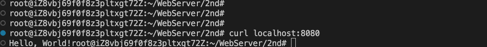
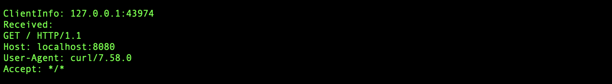
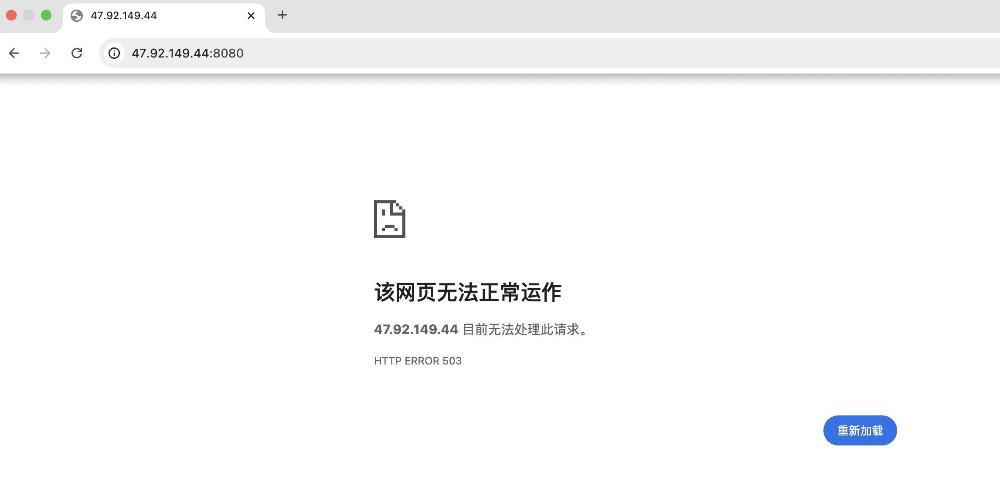
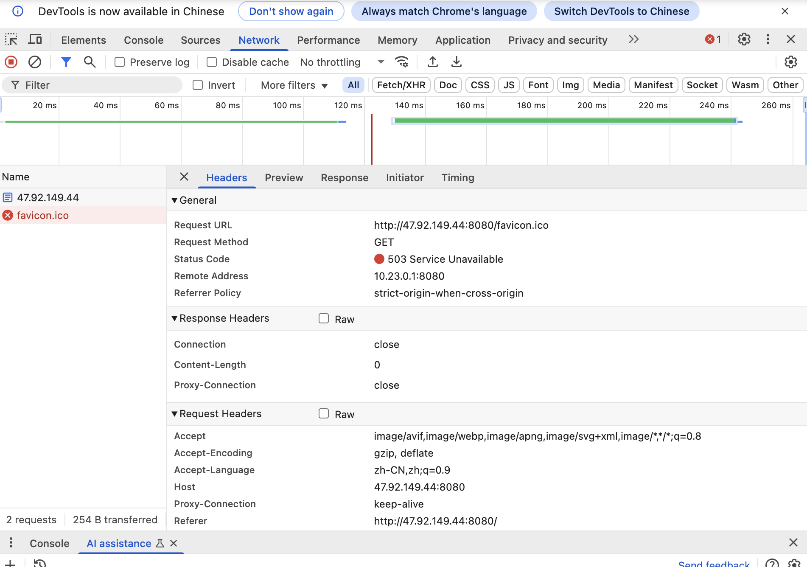
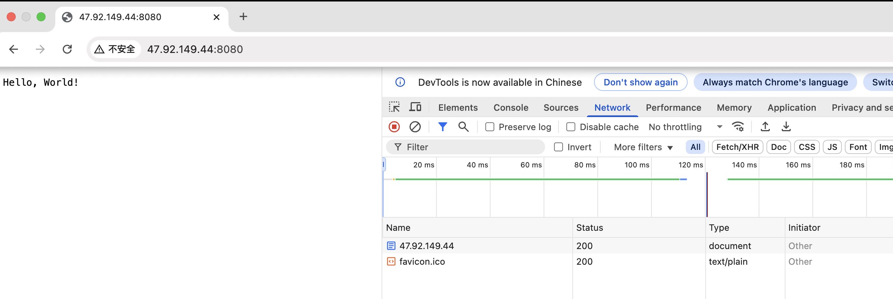
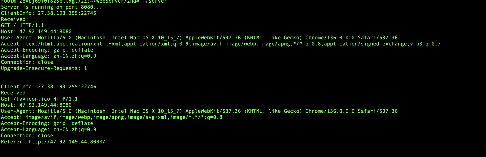

# 完成浏览器和服务器的持续交互
## ver1

+ 通过curl命令模拟客户端：
`curl locahost:8080`

当通过浏览器向服务器发出请求时，出现503错误。

通过chrome浏览器的检查工具的network，发现实际上浏览器发送了 2 个请求：
第一个请求 GET /（根路径）
第二个请求 GET /favicon.ico（浏览器自动请求的图标）

实际上存在浏览器发送了两个请求，但是服务器端却只有第一个请求的记录
显然，问题应该出在服务器在读取请求时，它只读取了第一个部分，剩下的数据没有被处理，导致后续的请求处理出现问题

所以便有了版本2，读取客户端请求时，循环读取直到数据结束，即接收到完整的http头为止，可通过\r\n\r\n判断

