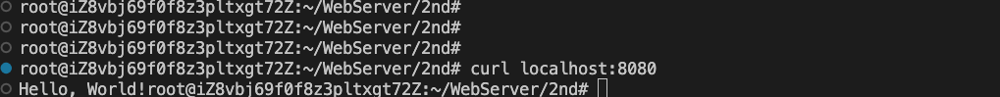
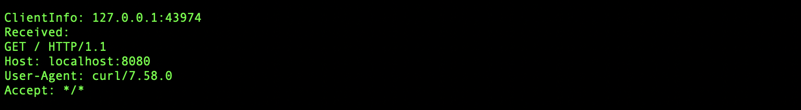
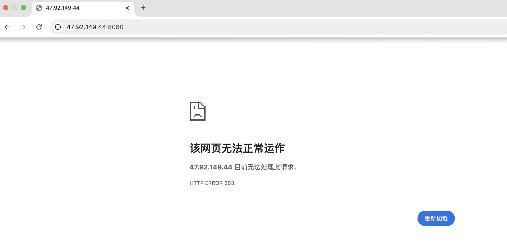
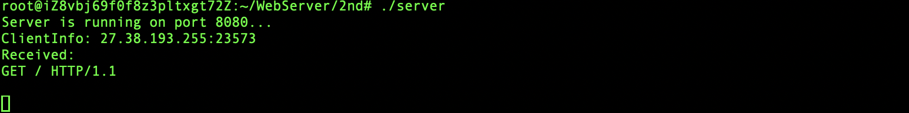
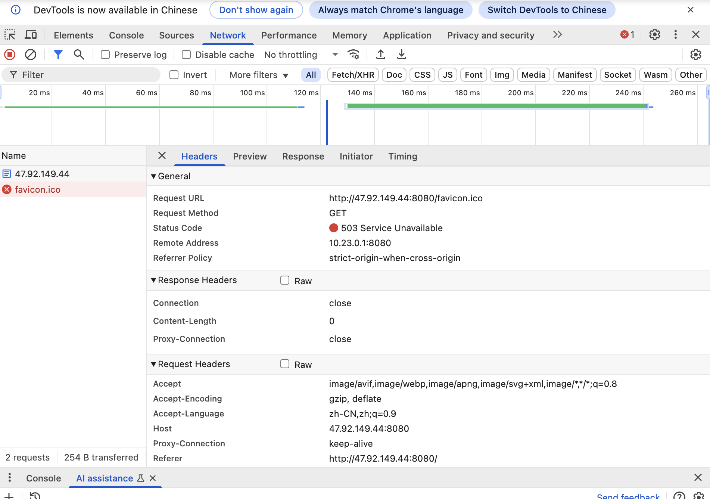
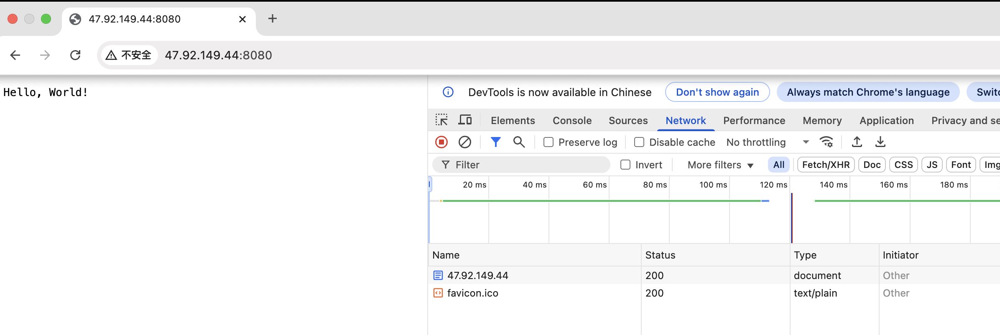
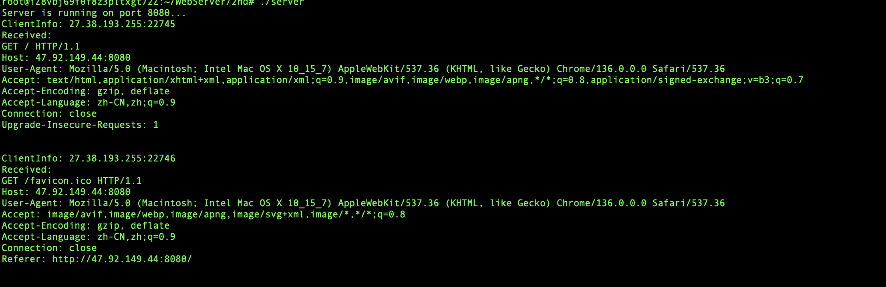
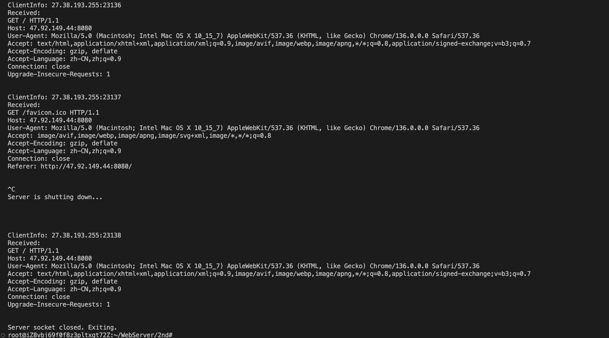
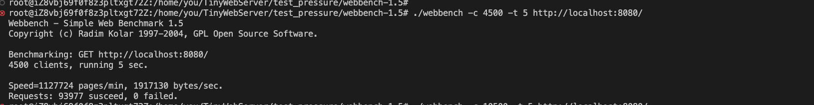

# 完成浏览器和服务器的持续交互
## ver1

通过curl命令模拟客户端： `curl locahost:8080`  

当通过浏览器向服务器发出请求时，出现503错误   

通过chrome浏览器的检查工具的network，发现实际上浏览器发送了 2 个请求：  
第一个请求 GET /（根路径）  
第二个请求 GET /favicon.ico（浏览器自动请求的图标）  

实际上存在浏览器发送了两个请求，但是服务器端却只有第一个请求的记录  
显然，问题应该出在服务器在读取请求时，它只读取了第一个部分，剩下的数据没有被处理，导致后续的请求处理出现问题  

## ver2

所以便有了版本2，读取客户端请求时，循环读取直到数据结束，即接收到完整的http头为止，可通过\r\n\r\n判断  

## ver3
但是ver2，存在一个很明显的问题，那就是server不会被释放，为了使其能正确释放，需要加入信号处理机制 
捕获终止信号。在信号处理函数中关闭serviceSock并退出程序 

当用户输入ctrl+c时，由于accept是阻塞调用，直到有新的连接到来，才会返回并检查bStopServer 

使用webbench工具，对服务器进行压力测试，压测时，注释掉没有必要的打印输出，qps在18795左右 

